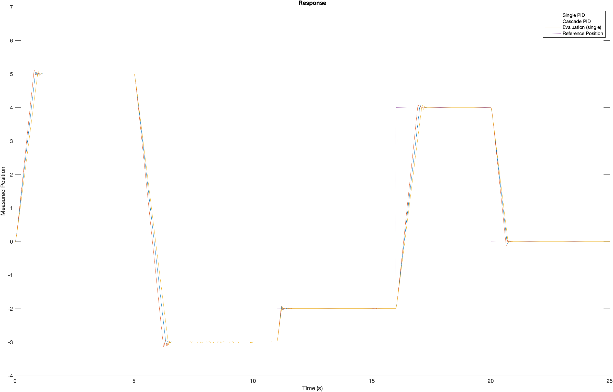

# mechatronics
Code for mechatronics class

The diagram below shows a comparison between single PID and cascaded PID control. The yellow line is data obtained during graded evaluation, which just used single PID control

